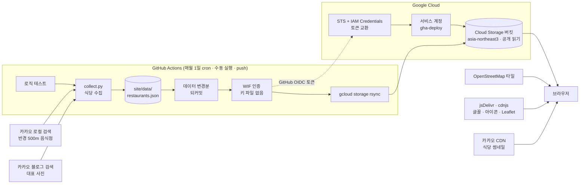

# 🍱 점심 뭐 먹지?

회사 근처 반경 500m 식당으로 점심을 고르는 정적 사이트.

* **함께 고르기** (첫 탭): 인원(2~10명)을 정하고 사람마다 `식당 이름 (메뉴)` 목록에서 고르거나 랜덤으로 채운 뒤, 고른 식당들 중 하나를 뽑는다. 한 사람이 한 표라 여러 명이 고른 식당일수록 잘 뽑힌다.
* **사진 룰렛**: 종목의 근처 식당 전체에서 균등하게 하나를 뽑고, 사진 띠가 흘러가다 그 식당에 멈춘다.
* **식당 월드컵**: 종목의 근처 식당끼리 8강 / 16강 / 32강 토너먼트로 직접 고른다.
* 고른 결과마다 **근처 식당 목록 + 지도** + 카카오맵 링크.

서버 프로세스 0개, 컨테이너 0개, DB 0개. Cloud Storage 버킷 하나로 서빙하고 GitHub Actions가 매월 식당을 다시 모아 배포한다.

---

## 아키텍처



push 때는 수집을 건너뛰고 테스트와 배포만 한다. 수집은 매월 cron과 수동 실행(`workflow_dispatch`) 때만 돈다.

### 경계는 어디고 왜 거기인가

| 경계 | 위치 | 이유 |
| --- | --- | --- |
| **외부 API ↔ 우리 데이터** | `scripts/collect.py` 의 `slim()` · `pick_photo()` | 카카오 응답 스키마는 여기서만 안다. 사이트는 `{id, name, category, address, lat, lng, distance, url, photo, photoSource}` 만 본다. 데이터 소스를 바꿔도 이 파일만 고친다. 실제로 네이버에서 카카오로 바꿀 때 사이트 코드는 거의 안 건드렸다. |
| **수집 ↔ 사이트** | `site/data/restaurants.json` | 두 모듈 사이의 유일한 접점(데이터 계약). 나중에 API 서버가 필요해지면 이 JSON을 같은 모양의 HTTP 엔드포인트로 바꾸면 분리가 끝난다. 식당 79곳이라 DB는 필요 없다. |
| **설정 ↔ 코드** | `site/data/menus.json` | 중심 좌표·반경·메뉴 카탈로그·지역 단어·사진 제외 목록. 수집기와 사이트가 같은 파일을 읽어서 메뉴 목록이 둘로 갈라질 수 없다. |
| **도메인 ↔ 표현** | `site/game.js` ↔ `site/app.js` | `game.js` 는 토너먼트 진행, 릴 당첨 칸 배치, 함께 고르기 인원 조정 같은 순수 함수만 둔다. DOM·fetch·전역 상태가 없어서 브라우저와 node 테스트에서 같은 코드가 돈다. `app.js` 는 그 결과를 그리기만 한다. |
| **결정 ↔ 연출** | `app.js` 의 `reelOf()` | 당첨은 `Math.random()` 으로 먼저 뽑고, 사진 릴은 그 칸에 멈추는 애니메이션만 한다. 연출이 확률을 바꿀 수 없다. 룰렛과 함께 고르기가 같은 릴을 쓴다. |
| **배포 권한** | WIF `attribute-condition` | GCP는 이 저장소에서 발급된 GitHub 토큰만 받는다. 서비스 계정은 이 버킷에만 쓸 수 있다. |

### 구조

```
site/data/menus.json        설정     중심 좌표·반경·메뉴 카탈로그·지역 단어·사진 제외 목록
site/data/restaurants.json  데이터   수집 결과. 식당(id별) + 메뉴별 식당 id 목록
scripts/collect.py          수집     카카오 로컬 키워드 검색 + 블로그 검색(대표 사진)
scripts/test_collect.py     검증     응답 변환·반경 필터·중복 제거·대표 사진 매칭
site/game.js                도메인   토너먼트·릴 당첨 칸·함께 고르기. DOM·fetch 없음
scripts/test_game.mjs       검증     브래킷 진행·릴 칸 배치·인원 조정·빈 칸 채우기
site/app.js                 표현     game.js 결과와 JSON을 그리기만 함
site/index.html, style.css  표현
.github/workflows/deploy.yml         테스트 → (수집 → 되커밋) → WIF 인증 → 배포
```

### 대표 사진은 어떻게 고르나

카카오 이미지 검색은 결과에 글 제목·본문이 없어서 식당과 무관한 사진(예: 중식당에 키보드 사진)이 섞였다.
그래서 **블로그 검색**으로 바꾸고, 글 제목·본문에 식당 이름과 지역 단어(`regionWords`)가 **둘 다** 있는 글의 썸네일만 쓴다.
맞는 글이 없으면 사진 없이 아이콘을 보여준다. 사람 얼굴이 나오는 글은 `menus.json` 의 `photoExclude` 에 글 주소를 넣어 뺀다.

### 데이터 소스를 고른 과정

| 후보 | 결과 |
| --- | --- |
| 네이버 지역 검색 | 쿼리당 5건, 반경 파라미터 없음. 커버리지가 부족해서 뺐다. |
| OpenStreetMap (Overpass) | 키가 필요 없지만 반경 500m 안 식당이 3곳뿐이었다. |
| Google Places | 반경 검색은 되지만 국내 식당 정보가 카카오보다 적다. 구글 데이터를 구글 지도가 아닌 지도와 함께 쓰면 약관에 걸린다. |
| **카카오 로컬** | `radius=500` + `category_group_code=FD6`(음식점)로 메뉴별 식당이 바로 나온다. 쿼리당 45건. 월 1회 수백 호출이라 무료 한도 안이다. |

---

## 사용한 Google Cloud 서비스

| 서비스 | 여기서 한 일 | 왜 이걸 썼나 |
| --- | --- | --- |
| **Cloud Storage** | `site/` 를 담는 버킷. `allUsers` 읽기 공개로 정적 사이트를 서빙한다. | HTML·JS·JSON 150KB가 전부라 서버가 필요 없다. 요청이 0이면 비용도 거의 0이다. |
| **IAM 서비스 계정** | 배포 전용 `gha-deploy`. 이 버킷에만 `objectAdmin` + `legacyBucketReader` 권한이 있다. | 배포 주체를 사람 계정과 분리하고 권한을 버킷 하나로 좁힌다. |
| **Workload Identity Federation** | GitHub Actions의 OIDC 토큰을 GCP가 직접 검증해 서비스 계정으로 바꿔 준다. 풀 `github`, 프로바이더 `github-actions`. | 서비스 계정 JSON 키를 만들지 않는다. 유출될 키 자체가 없고, 이 저장소에서 온 요청만 받는다. |
| **Security Token Service API** (`sts`) | WIF가 GitHub 토큰을 GCP 연합 토큰으로 교환할 때 쓴다. | WIF의 필수 구성 요소. |
| **IAM Service Account Credentials API** (`iamcredentials`) | 연합 토큰으로 서비스 계정의 짧은 수명 액세스 토큰을 발급한다. | WIF의 필수 구성 요소. 토큰은 1시간이면 만료된다. |
| **Cloud Billing** | 프로젝트에 결제 계정을 연결한다. | 결제 연결 없이는 버킷에 업로드가 거부된다(403). |

### 일부러 안 쓴 서비스

| 서비스 | 안 쓴 이유 |
| --- | --- |
| Cloud Run | 정적 파일만 내보내면 된다. 컨테이너 빌드·레지스트리·콜드스타트를 떠안을 이유가 없다. |
| Cloud Scheduler | 월 1회 수집은 GitHub Actions `schedule` 로 충분하고, 수집 결과를 저장소에 커밋까지 해야 한다. |
| Secret Manager | 카카오 키는 CI에서만 쓰여서 GitHub 시크릿으로 충분하다. GCP 안에서 도는 런타임(Cloud Run 등)이 생기면 옮긴다. |
| 외부 HTTPS 로드밸런서 + Cloud CDN | 커스텀 도메인에는 필요하지만 트래픽과 무관하게 월 $18 정도 고정비가 든다. |
| Firestore · BigQuery | 식당 79곳짜리 JSON 하나라 DB가 오버킬이다. |

### Google Cloud 밖에서 쓰는 것

| 서비스 | 용도 |
| --- | --- |
| GitHub Actions | 테스트, 월간 수집, 배포 |
| 카카오 로컬 · 블로그 검색 API | 식당 목록, 대표 사진 (CI에서만 호출) |
| OpenStreetMap 타일 + Leaflet | 지도 표시. API 키가 필요 없다. |
| jsDelivr · cdnjs | Pretendard 글꼴, Phosphor 아이콘, Leaflet. 전부 SRI 해시로 고정했다. |

---

## 보안

* **키 파일 없음**: GCP 인증은 WIF만 쓴다. `--attribute-condition` 으로 이 저장소만 허용한다.
* **시크릿**: 카카오 키는 GitHub 시크릿과 로컬 `.env` 에만 있다. `.env` 는 `.gitignore` 에 있고, 사이트에는 키가 나가지 않는다.
* **최소 권한 워크플로**: `contents: write`(데이터 되커밋)와 `id-token: write`(WIF)만 연다. 1st-party 액션만 쓰고, `pull_request_target` 은 쓰지 않는다.
* **XSS**: 외부에서 온 텍스트는 전부 `textContent` 로 넣는다. 데이터 속 링크·이미지 주소는 `http(s)` 로 시작할 때만 쓴다.
* **CDN 무결성**: 외부 CSS·JS는 전부 `integrity` 해시로 고정했다.

## 비용

| 항목 | 규모 | 월 비용 |
| --- | --- | --- |
| Cloud Storage 저장 | 약 150KB | 사실상 0 |
| 업로드 작업 | 배포당 수십 건 | 사실상 0 |
| 네트워크 이그레스 | 방문자 수에 비례. 사진은 카카오 CDN에서 받아서 버킷 트래픽은 작다. | 1GB당 약 $0.12 |
| 카카오 API | 월 1회 수백 호출 | 무료 한도 안 |

---

## 로컬 실행

```bash
cp .env.example .env                     # KAKAO_REST_API_KEY 채우기
set -a; source .env; set +a
python3 scripts/collect.py               # 식당 수집 (2분 정도)
python3 scripts/test_collect.py          # 수집 로직 검증
node scripts/test_game.mjs               # 게임 로직 검증
python3 -m http.server 8000 -d site      # http://localhost:8000
```

빌드 의존성 없음. Python 3, Node 18+ 표준 라이브러리만 쓴다.

### 카카오 API 키

[Kakao Developers](https://developers.kakao.com)에서 앱을 만들고 **REST API 키**를 복사한다. **제품 설정 → 카카오맵** 사용 설정도 켜야 한다.

## 배포 인프라 만들기

변수만 채우면 그대로 실행된다.

```bash
PROJECT_ID=<your-project-id>
BUCKET=<your-bucket>
REPO=<owner>/<repo>
REGION=asia-northeast3
ORG_ID=$(gcloud organizations list --format='value(ID)' | head -1)
BILLING=$(gcloud billing accounts list --format='value(ACCOUNT_ID)' | head -1)
SA=gha-deploy@$PROJECT_ID.iam.gserviceaccount.com

# 1. 프로젝트 + 결제 + API
gcloud projects create "$PROJECT_ID" --organization="$ORG_ID"
gcloud billing projects link "$PROJECT_ID" --billing-account="$BILLING"
gcloud services enable storage.googleapis.com iamcredentials.googleapis.com sts.googleapis.com --project="$PROJECT_ID"

# 2. 공개 버킷
gcloud storage buckets create "gs://$BUCKET" --project="$PROJECT_ID" --location="$REGION" --uniform-bucket-level-access
gcloud storage buckets add-iam-policy-binding "gs://$BUCKET" --member=allUsers --role=roles/storage.objectViewer

# 3. 배포 전용 서비스 계정 (이 버킷에만 권한)
gcloud iam service-accounts create gha-deploy --project="$PROJECT_ID"
for role in roles/storage.objectAdmin roles/storage.legacyBucketReader; do
  gcloud storage buckets add-iam-policy-binding "gs://$BUCKET" --member="serviceAccount:$SA" --role="$role"
done

# 4. Workload Identity Federation (이 저장소만)
PN=$(gcloud projects describe "$PROJECT_ID" --format='value(projectNumber)')
gcloud iam workload-identity-pools create github --location=global --project="$PROJECT_ID"
gcloud iam workload-identity-pools providers create-oidc github-actions \
  --location=global --workload-identity-pool=github --project="$PROJECT_ID" \
  --issuer-uri="https://token.actions.githubusercontent.com" \
  --attribute-mapping="google.subject=assertion.sub,attribute.repository=assertion.repository" \
  --attribute-condition="assertion.repository=='$REPO'"
gcloud iam service-accounts add-iam-policy-binding "$SA" --project="$PROJECT_ID" \
  --role=roles/iam.workloadIdentityUser \
  --member="principalSet://iam.googleapis.com/projects/$PN/locations/global/workloadIdentityPools/github/attribute.repository/$REPO"

# 5. 저장소 시크릿
gh secret set GCP_WIF_PROVIDER --repo "$REPO" --body "projects/$PN/locations/global/workloadIdentityPools/github/providers/github-actions"
gh secret set GCP_SA_EMAIL --repo "$REPO" --body "$SA"
gh secret set GCS_BUCKET --repo "$REPO" --body "$BUCKET"
gh secret set -f .env --repo "$REPO"     # KAKAO_REST_API_KEY
```

### 걸렸던 함정

1. **결제 계정의 프로젝트 연결 한도.** 새 결제 계정은 연결할 수 있는 프로젝트 수가 적다(이번엔 5개). 한도에 걸리면 결제 연결이 거부되고 업로드가 403이 난다. 안 쓰는 프로젝트의 결제를 해제하거나 한도 증설을 요청한다.
2. **결제 연결 직후 업로드 일부 실패.** 반영에 몇 초가 걸린다. rsync를 한 번 더 돌리면 된다.
3. **`objectAdmin` 만으로는 rsync가 실패한다.** 버킷 메타데이터 조회에 `legacyBucketReader` 가 같이 필요하다.
4. **WIF 프로바이더 ID는 4~32자.**
5. **`/index.html` 을 붙여야 한다.** `https://storage.googleapis.com/<BUCKET>/` 는 버킷 목록 XML이 나온다. 메인 페이지 설정은 커스텀 도메인에서만 먹는다.
6. **`--cache-control` 을 안 주면 1시간 캐시.** 워크플로는 5분(`max-age=300`)으로 올린다.

## 데이터 출처

식당 정보는 카카오 로컬 API, 대표 사진은 카카오 블로그 검색 결과의 썸네일(원문 링크를 "사진 출처"로 표시), 지도는 © OpenStreetMap 기여자.
이 저장소는 카카오와 관련이 없다.
